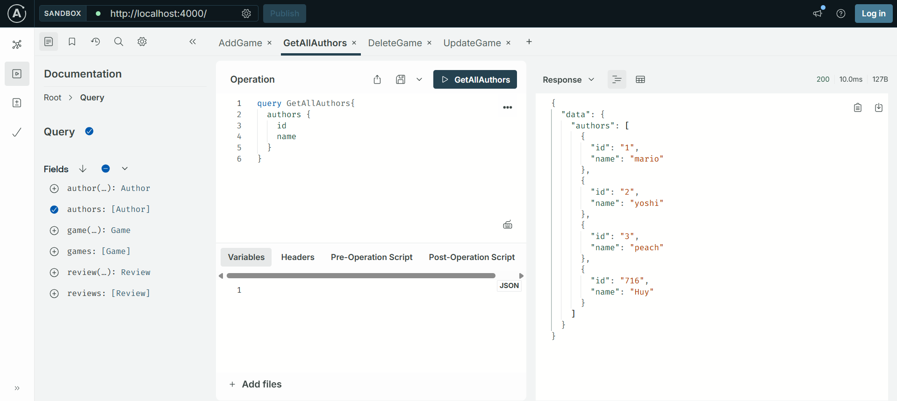
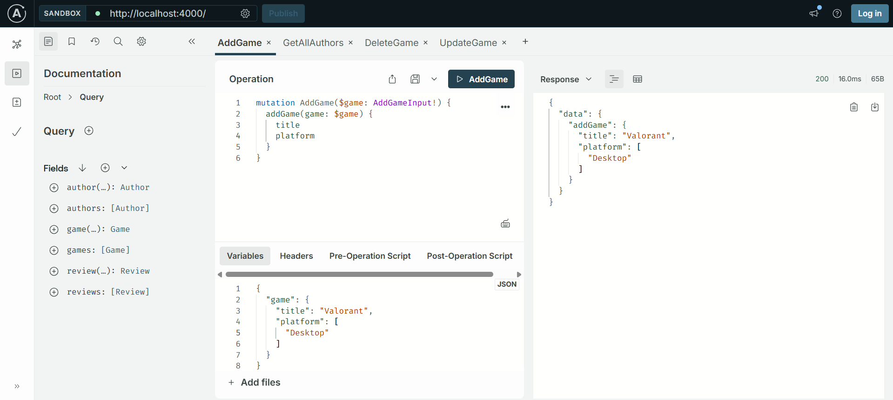

# GraphQL Simple API  

A minimal GraphQL API built with Node.js for learning and practice purposes.  

## 🚀 Features  
- Basic CRUD operations using GraphQL  
- Three simple entities: `Author`, `Game`, and `Review`  
- Lightweight and easy to extend  
- Uses Apollo Server  

## 📦 Installation  
Clone the repository and install dependencies:  
```sh  
git clone https://github.com/trapper268/graphql-simple-api.git  
cd graphql-simple-api  
npm install  
```  

## ▶️ Running the API  
Start the server in development mode:  
```sh  
nodemon index.js  
```  
The GraphQL Playground will be available at `http://localhost:4000`.  

## 📜 API Schema  
### Author  
```graphql  
type Author {  
  id: ID!  
  name: String!  
}  
```  

### Game  
```graphql  
type Game {  
  id: ID!  
  title: String!  
  author: Author!  
}  
```  

### Review  
```graphql  
type Review {  
  id: ID!  
  content: String!  
  game: Game!  
}  
```  

## 📸 Example Queries  

### Get all authors


###



## 🛠 Tech Stack  
- **Node.js**  
- **Apollo Server**  
- **GraphQL**  